# CloudStorages.Server

- A modular and extensible .NET 7 Web API that provides unified file-storage operations across multiple providers, including Amazon S3 and Azure Blob Storage.
  The project implements common storage endpoints via a generic controller and provider-specific service implementations.

## Table of Contents

- [Project structure](#-project-structure)
- [Features](#-features)
- [How to run](#-how-to-run)
  - [Clone repo](#1-clone-repo)
  - [Install prerequisites](#2-install-prerequisites)
  - [Restore and build](#3-restore-and-build)
  - [AWS setup](#4-aws-setup)
  - [Azure setup](#5-azure-setup)
  - [Google setup](#6-google-cloud-setup)
  - [Retrieve and store secrets](#7-retrieve-and-store-secrets-in-storage-providers)
  - [Application configuration](#8-application-configuration)
  - [Run the API](#9-run-the-api)
- [License](#-license)

## 📁 Project structure

```
CloudStorages.Server/
│
├── Configuration/
│   ├── AwsS3Settings.cs
│   └── AzureBlobSettings.cs
│
├── Controllers/
│   ├── AwsS3StorageController.cs
│   ├── AzureBlobStorageController.cs
│   └── StorageController.cs               # Generic base controller
│
├── Dtos/
│   ├── Requests/
│   └── Responses/
│
├── Filters/
│   └── DecodeRouteKeyAttribute.cs         # Automatically decodes the file key
│
├── Middlewares/
│   └── ExceptionHandlingMiddleware.cs     # Global exception handler
│
├── Services/
│   ├── AwsS3StorageService.cs
│   ├── AzureBlobStorageService.cs
│   ├── IAwsS3StorageService.cs
│   ├── IAzureBlobStorageService.cs
│   └── IStorageService.cs                 # Common interface
│
├── Utils/
│
├── appsettings.json
└── Program.cs

```

## ✨ Features

### ✔ Common Storage Operations

- All providers implement:

  - Generate upload URL

  - Generate download URL

  - Upload file(s)

  - Download file

  - List all files

  - Delete file

  - Create container

  - List containers

  - Check container existence

### ✔ AWS S3 extra features

- Multipart upload

  - Pre-signed URLs for each upload part

  - Complete multipart upload

### ✔ Unified controller design

The base class:

```
StorageController<TStorageService>
```

automatically provides all core REST endpoints, so each provider only needs to register its service.

## 🚀 How to run

### 1. Clone repo

```
git clone https://github.com/sonnh02-dev/CloudStorages.git
cd CloudStorages.Server
```

### 2. Install prerequisites

- .NET SDK 7+

- Azure CLI (for Key Vault integration)

- Cloud resources:

  - AWS S3 Bucket
  - Azure Blob Storage account + container

### 3. Restore and build

- `dotnet restore`
- `dotnet build`

### 4. AWS setup

- AWS S3 Storage :

  - Create bucket  
    

  - Configure CORS  
    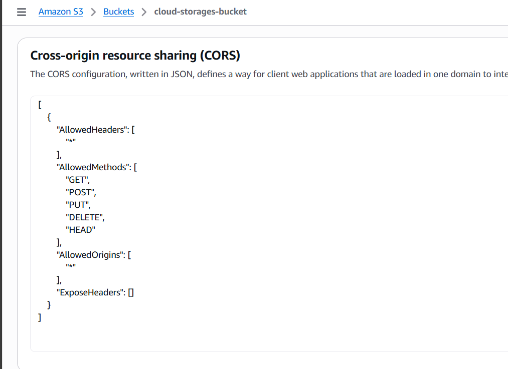

### 5. Azure setup

- Azure Blob Storage :

  - Create storage account, container  
    

  - Configure CORS  
    

- Azure Key Vault:

  - Create key vault
    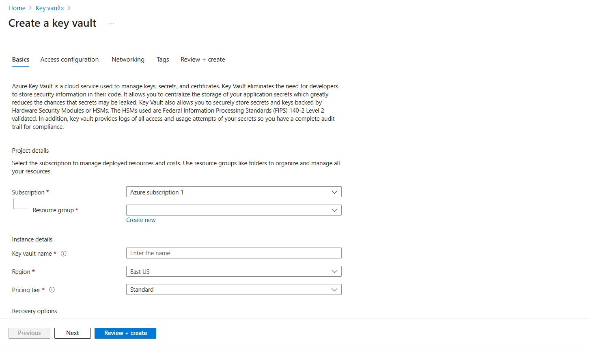
  - Assign Role "Key Vault Administrator" to yourself
    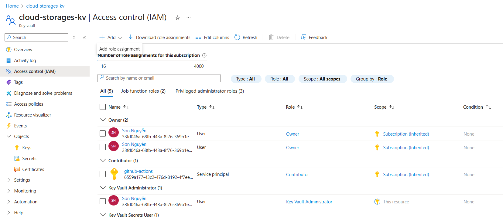

- Azure App Registration

  - Create an App Registration

    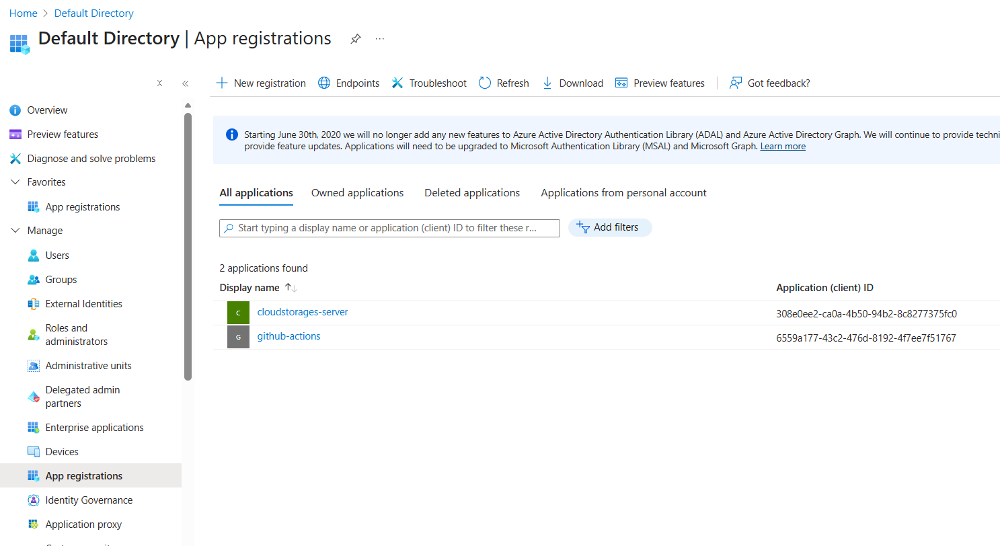

  - Obtain clientId, tenantId and clientSecret
    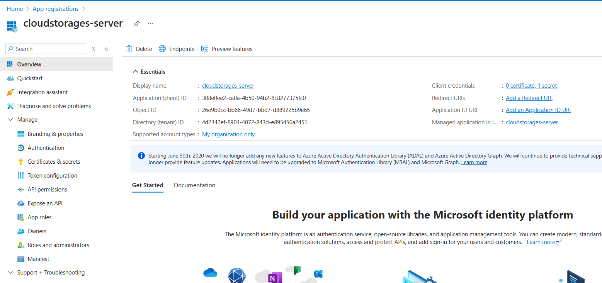

### 6. Google Cloud setup 
 - Create project 
    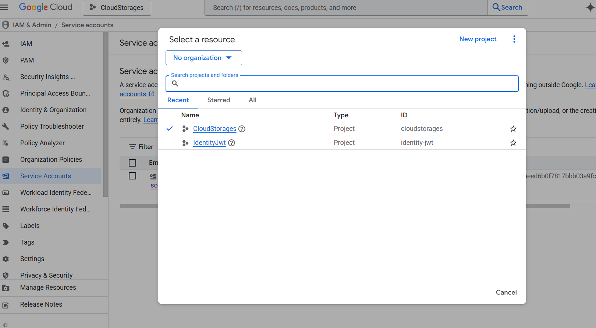
 - Create an Bucket
    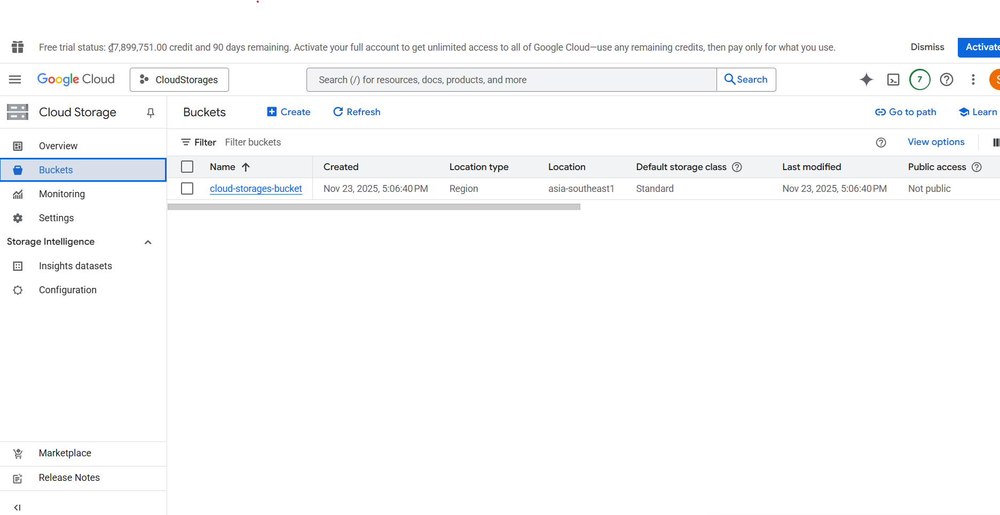
 - Create an IAM service account** and generate a key to obtain credentials
    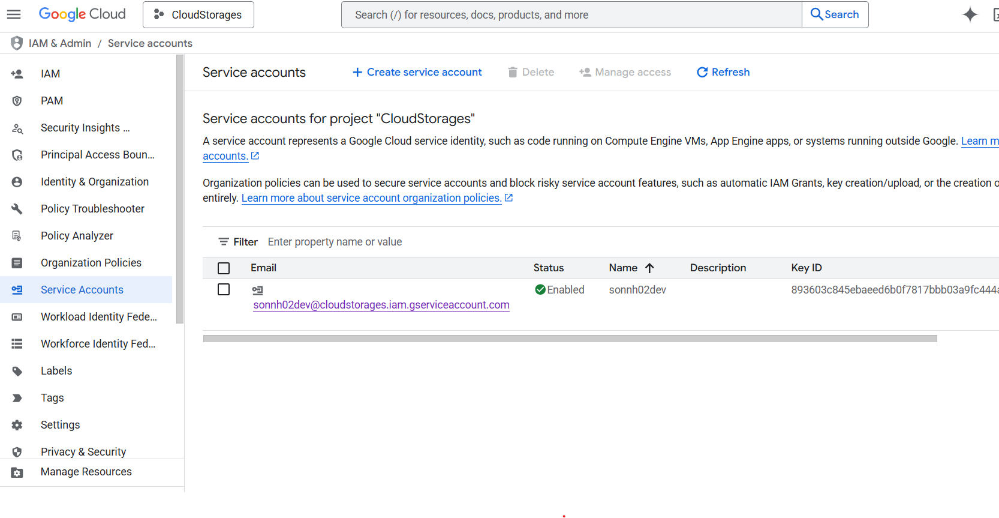
    
     
### 7. Retrieve and store secrets in storage providers
- Retrieve secrets

  - **AWS S3**: retrieve the access key and secret key from AWS IAM. If the secret key has been lost, generate a new one.  
    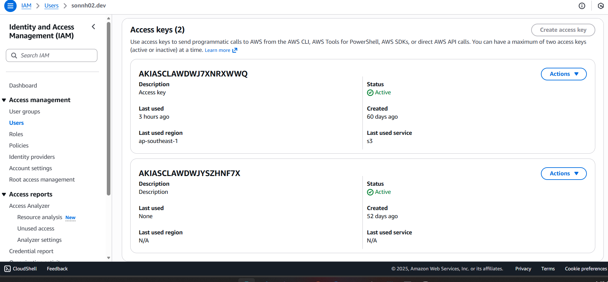

  - **Azure Blob**: retrieve the connection string from Azure Blob Access Keys.  
    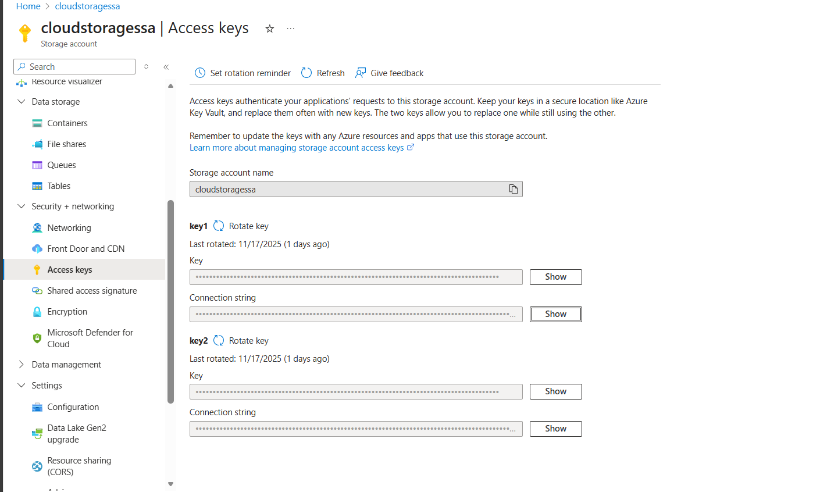

- Store Secrets in Azure Key Vault

  - Set secret values in Azure Key Vault  
    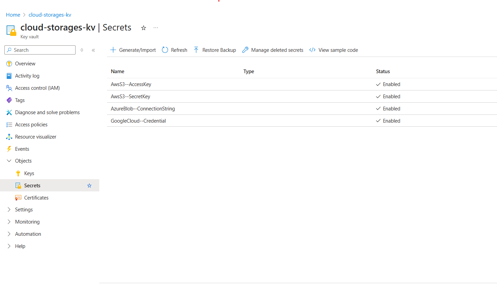

  - Secrets must follow this naming pattern for automatic configuration mapping:
    ```
    AwsS3--AccessKey
    AwsS3--SecretKey
    AzureBlob--ConnectionString
    GoogleCloud--Credential
    ```

### 8. Application configuration

- Combine secrets with appsettings.json:

  ```
  {
    "AzureKeyVault": {
      "ClientId": "308e0ee2-ca0a-4b50-94b2-8c8277375fc0",
      "TenantId": "4d2342ef-8904-4072-843d-e895456a2451",
      "VaultName": "cloud-storages-kv"
     },

    "AwsS3": {
      "BucketName": "cloud-storages-bucket",
      "Region": "ap-southeast-1"
     },

    "AzureBlob": {
      "AccountName": "cloudstoragessa",
      "ContainerName": "cloud-storages-container"
    },
    "GoogleCloud": {
      "BucketName": "cloud-storages-bucket",
      "ProjectId": "cloudstorages"
    }
  }
  ```

- Staging (Docker Swarm, Docker Compose, VPS,..) uses ClientSecretCredential because there is no Managed Identity :

  ```
  if (!string.IsNullOrEmpty(clientSecret) && builder.Environment.IsStaging())
  {
    var credential = new ClientSecretCredential(
        keyVaultSettings?.TenantId,
        keyVaultSettings?.ClientId,
        clientSecret
    );
    // Load secrets from Azure Key Vault into Configuration
    builder.Configuration.AddAzureKeyVault(keyVaultUri, credential);
  }
  ```

- Production (Azure App Service, Azure Container Apps, AKS,..) uses DefaultAzureCredential to use Managed Identity safely, without needing to save secrets :

  ```
  builder.Configuration.AddAzureKeyVault(keyVaultUri, new DefaultAzureCredential());
  ```

### 9. Run the API

- Swagger UI will be available at:
  `https://localhost:<port>/swagger`
- Dependency Injection Setup
  ```
  builder.Services.AddScoped<IAwsS3StorageService, AwsS3StorageService>();
  builder.Services.AddScoped<IAzureBlobStorageService, AzureBlobStorageService>();
  ...
  ```
  Each controller consumes the corresponding service automatically.

## 📄 License

This project is open-source for educational and personal use.
